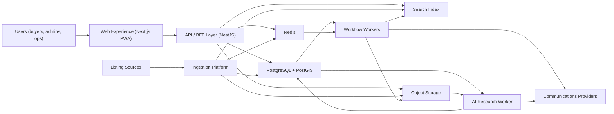

# Full Product Architecture Draft

## 1. Why this draft exists

This document derives a target architecture for the complete Jinka-style Egypt real estate product from the current repo state, instead of starting from a blank-slate microservices diagram.

Today the repo already contains the right foundations:

- `apps/web`: bilingual consumer web app and admin surfaces
- `apps/api`: NestJS modular monolith for auth, listings, projects, alerts, favorites, shortlists, reports, notifications, and admin ops
- `apps/crawler`: async ingestion pipeline with queue stages, source connectors, deduplication, and fraud scoring handoff
- `apps/api/prisma/schema.prisma`: a solid transactional model for catalog, user intent, ops, and ingestion metadata
- `docs/ai-buyer-assistant.md`: a credible extension toward an AI-assisted buying workflow

The architecture below keeps what is already working, and only splits deployable components where scale, latency, risk, or team ownership actually justify it.

## 2. Architecture principles

1. Keep the product a modular monolith for business domains until scale or team boundaries force a split.
2. Keep ingestion, search indexing, and heavy async workflows outside the request path.
3. Use PostgreSQL as the source of truth for product state.
4. Introduce a dedicated search index for discovery quality and scale, but do not make it the system of record.
5. Persist source evidence and operator actions for trust, auditability, and compliance.
6. Design the AI workflow as evidence-backed and approval-first, not as a freeform chatbot bolted onto the UI.
7. Optimize for Egypt-specific bilingual search, map exploration, source reliability variance, and anti-bot realities.

## 3. Recommended target state

### 3.1 Top-level systems

### 3.2 Deployable components

#### 1. Experience Layer

- `web-app`: Next.js app for marketing, authenticated search, projects, favorites, alerts, inbox, shortlists, and account
- `admin-console`: same codebase, separate route space and auth policy for ops/admin workflows
- `partner-surfaces`: optional future layer for developers or brokers, only if the business expands beyond consumer aggregation

Recommendation:
- Keep all UI in `apps/web`
- Separate by route groups and authorization, not by separate frontend repos

#### 2. Core API Platform

Single primary backend deployable in the near-to-medium term, implemented as a modular monolith:

- Identity and sessions
- User profile and preferences
- Listings catalog read APIs
- Projects catalog read APIs
- Favorites, alerts, shortlists, reports
- Notification read APIs
- Admin and ops actions
- Internal orchestration endpoints if needed

Recommendation:
- Keep this in `apps/api`
- Split by domain modules first, not by service count

#### 3. Ingestion Platform

A separately deployable worker system dedicated to source acquisition and canonicalization:

- source scheduling
- discovery partition planning
- fetch and snapshot persistence
- parsing and normalization
- deduplication and canonical cluster updates
- fraud pre-scoring
- parser drift and connector health monitoring
- replay and backfill tooling

Recommendation:
- Keep this in `apps/crawler`
- Treat it as a data pipeline platform, not just a scraper script

#### 4. Workflow Workers

A worker tier for non-ingestion async product workflows:

- alert matching
- notification fanout
- shortlist activity processing
- report triage helpers
- search reindex jobs
- future billing or CRM side effects if ever added

Recommendation:
- Start as additional worker processes inside `apps/api`
- Split into `apps/worker` only when queue volume or deployment cadence diverges

#### 5. AI Research Platform

A dedicated worker for the buyer assistant flow described in `docs/ai-buyer-assistant.md`:

- research run orchestration
- listing evidence collection
- fact extraction and normalization
- broker outreach draft generation
- approval gating
- inbound message parsing
- recommendation and report generation

Recommendation:
- Do not put this in the request-serving API process
- Add it as a dedicated worker app once the feature is built seriously

#### 6. Search Platform

A read-optimized search subsystem for:

- bilingual text search
- typo tolerance
- geospatial map queries
- faceting
- ranking by freshness, trust, and fit
- autosuggest and area/project/developer suggestions

Recommendation:
- Use PostgreSQL for source-of-truth storage
- Use a dedicated search index for query serving at full scale
- Feed it from canonical catalog changes, not directly from raw source data

## 4. Recommended bounded contexts

The full product fits best into these business domains.

### 4.1 Identity and Accounts

Responsibilities:

- login, OTP, social auth
- session lifecycle
- locale and user preferences
- notification settings
- role-based access control

Current fit:

- already present in `apps/api/src/auth` and `apps/api/src/users`

### 4.2 Catalog and Discovery

Responsibilities:

- canonical listings
- listing variants
- projects and developers
- area hierarchy and map geometry
- read models for search, detail, and compare views

Current fit:

- already present across `listings`, `projects`, Prisma catalog tables, and crawler normalization

### 4.3 User Intent and Collaboration

Responsibilities:

- favorites
- alerts
- shortlists
- shortlist comments and sharing
- future saved searches and compare sets

Current fit:

- already present in `favorites`, `alerts`, `shortlists`

### 4.4 Trust and Moderation

Responsibilities:

- fraud scoring
- reports
- blacklists
- parser drift alarms
- connector controls
- admin audit logs

Current fit:

- already present across crawler and admin modules

### 4.5 Communications

Responsibilities:

- inbox notifications
- email
- web push
- future WhatsApp or provider-backed messaging for AI research

Current fit:

- present in notifications and push subscriptions
- should become a clearer standalone domain as more channels appear

### 4.6 Ingestion and Source Operations

Responsibilities:

- source registry
- connector execution
- crawl scheduling
- raw evidence storage
- replay, backfill, health metrics

Current fit:

- already concentrated in `apps/crawler`

### 4.7 AI Buyer Research

Responsibilities:

- buyer profiles
- research runs
- fact extraction
- broker threads and messages
- recommendation reports

Current fit:

- proposed in `docs/ai-buyer-assistant.md`
- should become its own domain, not hidden inside shortlists

## 5. Data architecture

### 5.1 System-of-record data stores

#### PostgreSQL + PostGIS

Keep as the primary transactional store for:

- users, sessions, alerts, favorites, shortlists
- canonical listings and variants
- projects, developers, areas
- reports, fraud cases, admin audit logs
- AI research entities
- ingestion metadata and job state that must be queryable by the product

Why:

- current repo is already structured around Prisma + Postgres
- PostGIS is the right anchor for area geometry and map filters
- relational integrity matters across catalog, trust, and collaboration

#### Object storage

Use for immutable or large artifacts:

- raw HTML and JSON snapshots
- screenshots
- replayable connector payloads
- exported reports
- AI evidence attachments

Why:

- the repo already uses MinIO-compatible raw snapshot storage
- evidence retention should not bloat the primary database

### 5.2 Operational support stores

#### Redis

Use for:

- BullMQ queues
- rate limiting
- short-lived caching
- distributed locks
- provider webhook deduplication

#### Search index

At full scale, add a dedicated search store.

Recommended responsibilities:

- listing and project search documents
- autosuggest documents
- geo-aware query execution
- faceting and ranking

Source of truth:

- never authoritative
- always rebuildable from PostgreSQL + object storage evidence

### 5.3 Analytics and BI

Add a warehouse only when business reporting or growth analysis becomes painful in production Postgres.

Suggested future feeds:

- ingestion performance
- alert conversion
- source quality
- funnel analytics
- fraud and moderation outcomes
- research assistant outcomes

This should be downstream of the product systems, not mixed into the request-serving path.

## 6. Search architecture

### 6.1 Recommendation

Use a dual-store model:

- PostgreSQL + PostGIS for canonical data and strong filters
- dedicated search index for low-latency discovery and ranking

### 6.2 Search document model

Maintain separate read models:

- `listing_search_document`
- `project_search_document`
- `area_search_document`
- optional `developer_search_document`

Each document should include:

- bilingual text fields
- normalized location and area hierarchy
- price, size, beds, baths
- freshness
- fraud label and trust score
- source count and canonical variant count
- ranking features such as recency, price competitiveness, and completeness

### 6.3 Indexing flow

Recommendation:

- emit indexing jobs only after canonical cluster or project updates
- keep indexing idempotent
- allow full reindex from PostgreSQL snapshots

## 7. Async workflow architecture

### 7.1 Listing ingestion lifecycle

This is already the strongest architectural seam in the repo and should remain independently scalable.

### 7.2 Notification lifecycle

Trigger sources:

- new matching listing
- price drop
- shortlist share or comment
- AI research milestone
- ops or moderation events if needed

Required capabilities:

- user preference evaluation
- quiet hours
- channel routing
- deduplication
- delivery logging

### 7.3 AI research lifecycle

```mermaid
flowchart LR
  A["User starts research run"] --> B["Collect listing evidence"]
  B --> C["Infer missing fields"]
  C --> D["Draft broker outreach"]
  D --> E["Await user approval"]
  E --> F["Send via provider or handoff"]
  F --> G["Capture replies"]
  G --> H["Extract structured facts"]
  H --> I["Rank options"]
  I --> J["Generate compare view + report"]
```

This workflow should be stateful, resumable, and fully auditable.

## 8. API architecture

### 8.1 External API shape

Keep a single public API surface for the user-facing app.

Recommended layers inside `apps/api`:

- `controllers`: transport and auth
- `application services`: use-case orchestration
- `domain modules`: business rules
- `repositories`: Prisma and SQL access
- `events/jobs`: enqueue async work

### 8.2 Internal integration style

Prefer domain events and job payloads over direct cross-module coupling for:

- catalog changed
- price changed
- fraud label changed
- alert matched
- report filed
- research run advanced

Recommendation:

- keep BullMQ as the async backbone for now
- only move to Kafka or a heavier event bus if throughput, replay, or multi-consumer guarantees truly demand it

## 9. Recommended service split strategy

Do not jump to microservices now.

Use three stages.

### Stage A: Mature modular monolith

Deployables:

- `web`
- `api`
- `crawler`

This is still the right shape while:

- the team is small
- product iteration is fast
- most data wants relational joins
- operational overhead must stay low

### Stage B: Monolith + specialized workers

Deployables:

- `web`
- `api`
- `crawler`
- `worker`
- `research-worker`
- `indexer` if needed

This is the recommended full-product near-term target.

Why:

- request-serving and heavy async concerns separate cleanly
- each component can scale by queue pressure
- business logic can still live in one repo and shared packages

### Stage C: Selective service extraction

Only split business services when one of these becomes true:

- a domain needs independent deploy cadence
- a domain needs different data technology
- a domain has much higher scale than the rest
- a separate team clearly owns it

Likely first extraction candidates:

1. search platform
2. communications platform
3. AI research platform
4. ingestion control plane

Least urgent to extract:

- auth
- favorites
- shortlists
- admin CRUD flows

## 10. Infra topology recommendation

### 10.1 Core runtime

- containerized deploys for all apps
- managed PostgreSQL with PostGIS
- managed Redis
- S3-compatible object storage
- CDN in front of the web app
- background workers with separate autoscaling rules

### 10.2 Observability

Keep and expand the current observability posture:

- structured logs
- traces across API and workers
- queue metrics
- connector success and extraction coverage
- provider delivery metrics
- business metrics for alerts, favorites, shortlist usage, and AI research completion

### 10.3 Security and compliance

- OTP and session hardening
- role-based admin access
- audit logs for trust and ops actions
- retention rules for raw snapshots and broker messages
- takedown workflow for source complaints
- explicit permissions and rate limits for outbound messaging

## 11. Recommended repo evolution

Keep the monorepo.

Recommended additions:

- `apps/worker`: async product jobs outside HTTP request lifecycle
- `apps/research-worker`: AI buyer assistant orchestration
- `packages/contracts`: API DTOs and event payload contracts
- `packages/domain`: shared domain primitives and policy code where it reduces duplication
- `packages/search`: search document builders and indexing helpers
- `packages/source-sdk`: shared connector interfaces, parsers, fixtures, and anti-bot utilities

Recommended module cleanup inside `apps/api`:

- distinguish `catalog`, `intent`, `trust`, `communications`, and `admin` more explicitly
- move cross-module orchestration out of controllers into application services

## 12. What should stay as-is for now

These current choices are directionally correct and should stay:

- monorepo with shared packages
- Next.js web app
- NestJS API
- separate crawler runtime
- Prisma + PostgreSQL + PostGIS
- Redis + BullMQ
- object storage for raw evidence
- canonical cluster model with source variants
- ops controls for connectors, blacklists, parser drift, and fraud review

## 13. Main open decisions for iteration

These are the highest-value architecture questions to resolve next.

### Decision 1: Search engine choice

Need to decide:

- stay on PostgreSQL longer
- add OpenSearch
- add Typesense or Meilisearch

My recommendation:

- keep PostgreSQL for the current phase
- plan a dedicated search index in the full product target state
- choose the engine based on Arabic relevance quality, geo filtering, operational simplicity, and facet performance

### Decision 2: AI assistant deployment model

Need to decide whether the buyer assistant is:

- an extension of shortlist workflows
- a clearly separate research domain with its own workers and state model

My recommendation:

- model it as a separate domain from day one
- integrate with shortlists at the UI level, not the storage level

### Decision 3: Async backbone

Need to decide whether BullMQ remains enough for:

- ingestion
- notifications
- research orchestration
- indexing

My recommendation:

- BullMQ is enough for the foreseeable product stage
- revisit only if cross-service replay and high-volume fanout become painful

### Decision 4: Partner-facing roadmap

Need to decide whether the company will remain:

- consumer-only
- consumer-first but later developer or broker-enabled

This matters because it changes:

- auth model
- inventory ingestion contracts
- moderation workflows
- reporting architecture

### Decision 5: Trust posture

Need to decide how aggressive the platform becomes on:

- fraud scoring automation
- source suppression
- broker communication automation
- user-visible confidence labels

This affects both architecture and legal/compliance design.

## 14. Proposed “final architecture” statement

If I had to compress the recommendation into one sentence:

Build the complete product as a modular-monolith core platform around PostgreSQL + PostGIS, with independently scalable ingestion, workflow, search-indexing, and AI research workers, all in the same monorepo and all feeding a single bilingual consumer web experience.

## 15. Suggested next iteration topics

The next useful deep dives are:

1. bounded contexts and module ownership
2. target data model additions for the full product
3. search architecture and search engine choice
4. AI buyer assistant architecture
5. deployment topology and scaling model

